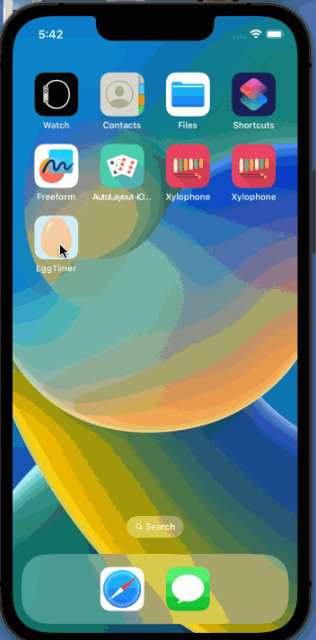
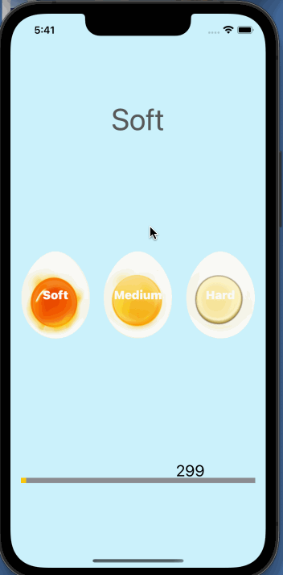

 

# Egg Timer

## Our Goal

The goal is to create a simple egg timer app for 3 types of boiled eggs. The data taken from studies. The app will display the remaining time for each type of egg that is chosen and the progress bar until its completion. When completed the alarm starts off!

## What I'll Make

You’ll be building a beautiful egg timer app to boil your eggs to perfection depending on how you prefer your eggs. 

## What I will learn

* Swift Collection types - Dictionaries
* The Swift Timer API
* Conditional statements - IF/ELSE
* Conditional statements - Switch
* Functions with outputs
* How to use the ProgressView

